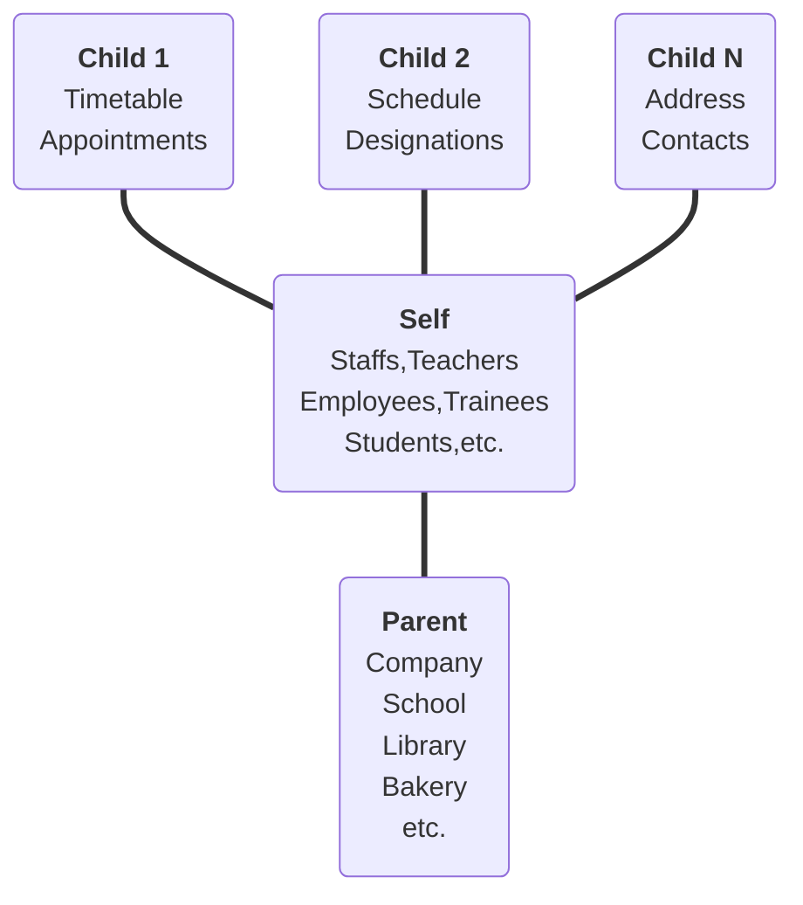

![
  A horizontal tech-noir banner for the 'Anisodactyl' library. The design
  features a dark, textured background composed of a grid of muted grey symbols
  that resemble futuristic or alien hieroglyphics. At the center, two large,
  minimalist white icons depict an artistic representation of anisodactyl bird
  footprints. A metaphorical nod to 'Crow’s Foot' database notation, where the
  hallux represents a parent table and the forward digits represent child
  relations. Below the icons, the word 'Anisodactyl' is rendered in a custom,
  geometric 'Modern Hieroglyphic' script, bridging the gap between ancient
  record-keeping and modern relational database architecture
](https://github.com/MidHunterX/Anisodactyl/raw/master/.assets/anisodactyl.jpg)

# Anisodactyl

> One CRUD to rule them all.

This tries to solve the following problems:

- [x] Headless CRUD Wrapper - Programmatic and configurable CRUD system for models.
- [x] Automatic CRUD API Endpoints - Create, Get, Get All, Patch Update and Delete REST API Endpoints for any database table.
- [x] Schema Driven URL Sorting and Filtering - URL based sorting and filtering automatically available to all properties listed in schema.
- [x] Swappable URL Conventions - Pick and choose between different URL conventions.
- [ ] Nested Database Mutations - Generic CRUD for nested databases. Eliminate N+1 network requests.

<br/>


## 👀 Vision

A typical CRUD interfaces db structure in a way where each table is a node:

`Parent? --- Current --< Children?`

Every table in your interconnected database sits at the center of it's own
relationship graph; optional `Parent` pointing inwards and optional `Children`
pointing outwards.



> The diagram above forms the shape of an anisodactyl "[crow foot](https://en.wikipedia.org/wiki/Entity–relationship_model#Crow's_foot_notation)" - digits (children), hallux (parent), connected through the central tarsometatarsus self.

Current object can be anything. It can be one of the children as well, being able to create any graph like structure imaginable.

<br/>


## 📚 Notes

### Query Parameter Conventions

#### [JSON API](https://jsonapi.org/format/#query-parameters)

```c
// ?filter[key_name][operator]=value&[key_name][operator]=value
?filter%5Bkey_name%5D%5Boperator%5D=value&%5Bkey_name%5D%5Boperator%5D=value
```

> but `[` and `]` gets encoded into `%5B` and `%5D` which makes URLs ugly and unreadable.

#### [Django REST Framework](https://www.django-rest-framework.org/api-guide/filtering/#orderingfilter)

```js
// ?post_tag=fiction&comment_count__gt=10
?key_name__operator=value&key_name__operator=value
```

> The python standard due to Django influence.

#### Anisodactyl

```js
// ?post_tag=fiction&comment_count=gt:10
?key_name=operator:value&key_name=operator:value
// ?fields=name,email
?fields=key1,key2,key3
// ?sort=-name
?sort=-field,field
```

> Super clean, simple and developer centric.

<!--
Fun fact
My thought process when creating the banner were:
- In a chain of relational database at any table/point, there will be the current table, an optional parent table which this table requires, optional number of child tables in relation.
- This almost looks like a bird's feet... parent as hallux, current as tarsometatarsus and child tables as digits
- The bird feet structure is known as Anisodactyl.
- "Crow's Foot" notation is used for designing Database ER diagrams.
- Birds are commonly used in ancient hieroglyphics but, database technologies are modern therefore the modern version of hieroglyphics is used as the whole aesthetic.
- The earliest known flying bird, Archaeopteryx, possessed anisodactyl feet.
- meaning Anisodactyl is the primitive avian foot. So is hieroglyphic script which is a primitive language.
- Anisodactyl can be seen as a pattern, just like the library; filled with patterns which can be reused.
- thus anisodactyl was chosen for this CRUD pattern library
-->

<br/>


