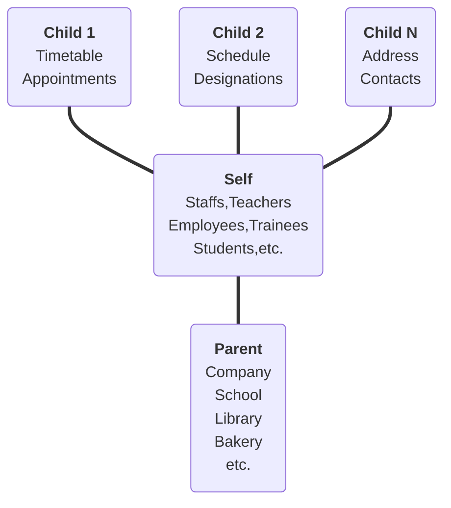

![A horizontal tech-noir banner for the 'Anisodactyl' CRUD automation library. The design features a dark, textured background composed of a grid of muted grey symbols that resemble futuristic or alien hieroglyphics. At the center, two large, minimalist white icons depict an artistic representation of anisodactyl bird footprints. A metaphorical nod to 'Crow’s Foot' database notation, where the hallux represents a parent table and the forward digits represent child relations. Below the icons, the word 'Anisodactyl' is rendered in a custom, geometric 'Modern Hieroglyphic' script, bridging the gap between ancient record-keeping and modern relational database architecture](./.assets/anisodactyl.jpg)

# Anisodactyl

> One CRUD to rule them all.

This tries to solve the following problems:

- Nested Database Mutations - Eliminate N+1 network requests.
- URL based Sorting and Filtering - Every possible sorting and filtering available via URL.
- Headless CRUD Engine
- Automatic CRUD API Endpoints

## 🚀 Quick Start

### Installation

```sh
pip install git+https://github.com/MidHunterX/Anisodactyl.git
```

### Development

```sh
git clone https://github.com/MidHunterX/Anisodactyl.git
cd Anisodactyl
pip install -e .[dev]
```

## 👀 Vision

A typical CRUD manipulates a database structure in this structure where each node is a table: `Parent? --- Current --< Children?`.
Every table in your interconnected database sits at the center of it's own relationship graph; optional `Parent` pointing inwards and optional `Children` pointing outwards.



> The diagram above forms the shape of an anisodactyl "[crow foot](https://en.wikipedia.org/wiki/Entity–relationship_model#Crow's_foot_notation)" - digits (children), hallux (parent), connected through the central tarsometatarsus self.

Current object can be anything. It can be one of the children as well, being able to create any graph like structure imaginable.

## 📚 Notes

- Package Structure: [Official Packaging Docs](https://packaging.python.org/en/latest/tutorials/packaging-projects/)

Generate distribution archives

```sh
python -m pip install --upgrade build
python -m build
```
